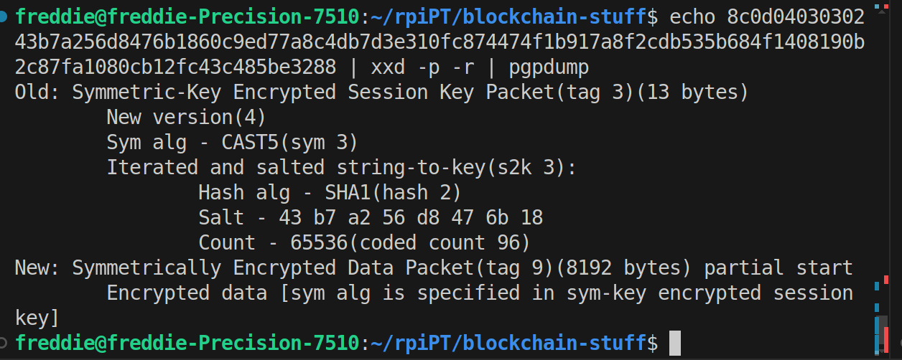

```
yarn add whatsonchain bsv

node downloadCablegate.js

node extractPythonDownloader.js > satoshi-downloader.py
```
Wikileaks relevant transactions (as on etherpad, http://archive.is/bk1rR):
1. 691dd277dc0e90a462a3d652a1171686de49cf19067cd33c7df0392833fb986a Cablegate.7z
2. 6c53cd987119ef797d5adccd76241247988a0a5ef783572a9972e7371c5fb0cc satoshi-downloader.py
3. 1c83034ca7c5b9dfe9207c0cbec3d657adb4b6631dcb21a0a78c083ff70b9396 instructions 1
4. 25787352904f4871fee31a76a48df0d77cac67207a182586ea632d4da9ec7fd3 instructions 2
5. bfb4e91ccc4f0996c76130a8408996f43d2c931a383ec36d3cab1ba1c0974008 magnet link 1 A
6. 757942f87e2eb44ec1d825135dc18e44846cbe0b41068f2cfa9b3ce96c81b404 magnet link 1 B
7. 5af6c330e0119f46bce7e201c98e99c54e56b5dbf297307d019708fd4a633060 
8. 8a75514829b6e30b9fea434eef77b1589ff3f4bdfc0056bd087efbfb8314eb59 file4.gpg
9. 18a7f0540b5ef6bb8707ad1f24ea93067023fa249791dc3697c10f46299bdd6d
10. aa353913b68ed3448cbd83ec942067eb4862b34bf88a1cc5d4ccbb10354f94a4 file4 url password hex string
11. 7379ab5047b143c0b6cfe5d8d79ad240b4b4f8cced55aa26f86d1d3d370c0d4c file1.gpg
12. cce82f3bde0537f82a55f3b8458cb50d632977f85c81dad3e1983a3348638f5c file3.gpg
13. 8f3b90d8de36b424a0afd51dee41d439b364079967ebf161302aa7b5a9094711 file5.gpg
14. ee7881862ceb30d9f957bc6edcae96e27099b126e275ff040672a76c8a6ee1b9 link pw hex string
15. ce81de6360502c6bc603fb77806b07eb52b796914a805196fe83f15cf7b8ff06 link pw hex string
16. 57065d22d9d6b26fe05d58d627fb1472baf6d2e3b494f13e7e781252a3c94e8d link pw hex string
17. d3c1cb2cdbf07c25e3c5f513de5ee36081a7c590e621f1f1eab62e8d4b50b635 file2.gpg
18. 4b0cd7e191ef0a14a9b6ab1c5900be534118c20a332ff26407648168d2722a2e dog.jpg



file -b gpgFiles/7379ab5047b143c0b6cfe5d8d79ad240b4b4f8cced55aa26f86d1d3d370c0d4c.gpg 
GPG symmetrically encrypted data (CAST5 cipher)
freddie@freddie-Precision-7510:~/rpiPT/blockchain-stuff$ pgpdump gpgFiles/
7379ab5047b143c0b6cfe5d8d79ad240b4b4f8cced55aa26f86d1d3d370c0d4c.gpg 
Old: Symmetric-Key Encrypted Session Key Packet(tag 3)(13 bytes)
        New version(4)
        Sym alg - CAST5(sym 3)
        Iterated and salted string-to-key(s2k 3):
                Hash alg - SHA1(hash 2)
                Salt - 43 b7 a2 56 d8 47 6b 18 
                Count - 65536(coded count 96)
New: Symmetrically Encrypted Data Packet(tag 9)(8192 bytes) partial start
        Encrypted data [sym alg is specified in sym-key encrypted session key]